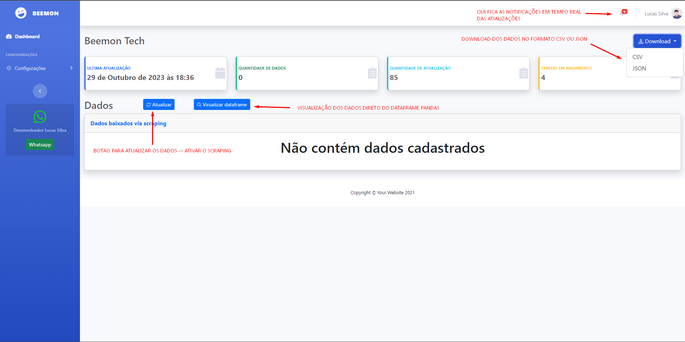
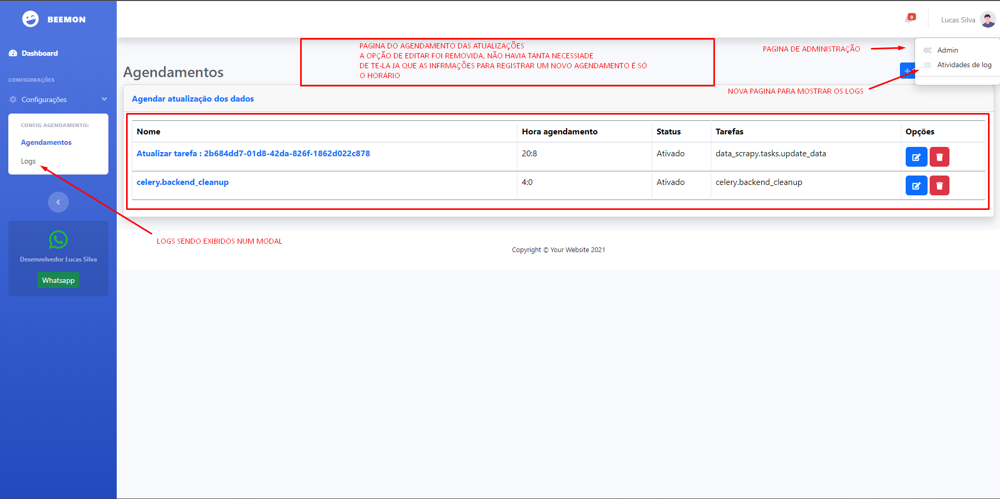
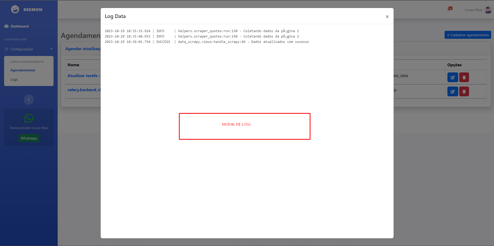
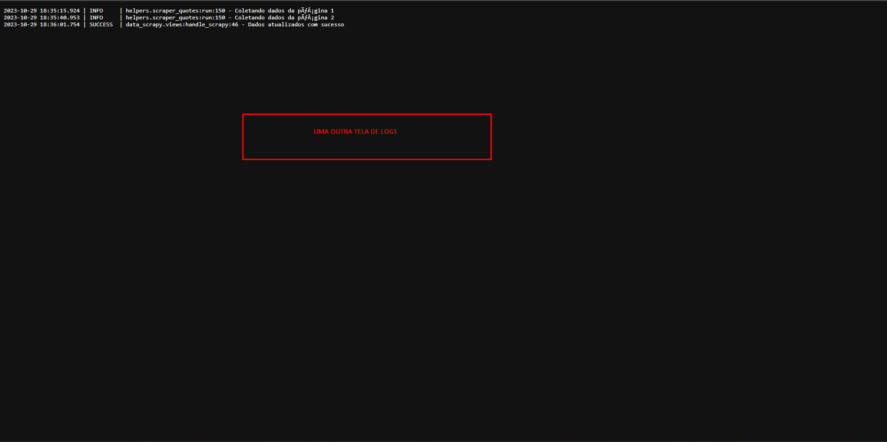
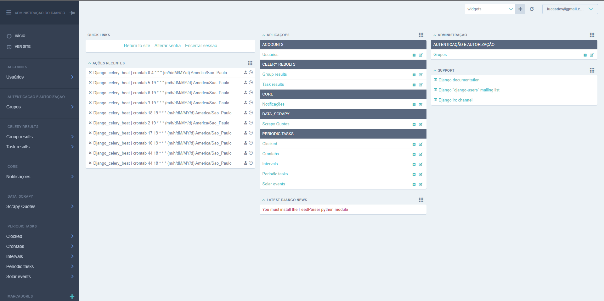
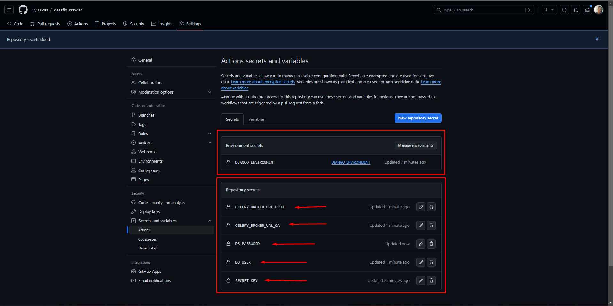

# DOCUMENTAÇÃO

## Aplicação na web [Clique Aqui](https://www.google.com.br)
## `INFORMAÇÕES IMPORTANTES`
**Ficaram algumas dúvidas sobre a descrição de como seria o projeto e o que realmente gostaria ver ver funcionando, então ficou funcionando da seguinte forma `(BRANCH "BOT" TEM O EXECUTÁVEL DO PROJETO E BRANCH "MAIN", TEM O PROJETO NA WEB)`**<br>
- *Foi utilizado o framework `django` para a execução do projeto em sí com intuíto de dar  escalabilidade do projeto, tanto na facilidade de tratamento das informações, quanto na visualização e diversas outras funcionalidades disponívels pelo framework*<br>
- *`celery` para agendamento dinámicos e escalável para o projeto, dando a disponibilidade para multiplos agendamentos e muitas funcionalidades úteis.*
- *`IMPORTANTE`: Não foi utilziado o `SELENIUM` pelo simples motivo de que a documentação pedia rapidez no script e como o site disponibilzava todos os benefícios a favor do `BEAUTIFULSOUP4`, então dispensei o `SELENIUM` para que o projeto não demorasse na capitura das informações. Mas o `SELENIUM` poderia ser facilmetne utilizado para fazer a abertuda do site e passar para `BS4` o `HTML` da página e assim ser mais ágil na raspagem de dados. Outro motivo de não ter utilizado o selenium é que para execução adequada iria utilizar o `SELENOID` como servidor para o mesmo, e na execução local talvez criasse uma dificuldade desnecessária já que sua configuração não é exatamente o foco do teste em sí.*

# COMO CONFIGURAR E EXECUTA?
- **Crie ambiente virtual e instale as dependências**
```
python -m venv venv
```

- **Ative o ambiente `Linux`**
```
souce venv/bin/activate
```

- **Ative o ambiente `Windows`**
```
venv/scripts/activate
```

- **Instalar `dependências`**
```
pip install -r requirements.txt
```

- **EXECUTANDO `TESTE` DO PROJETO**<br>
*OBS: `O projeto estpa conectado com Github action/workflow e os testes são feitos automaticamente em commit/push feito.`*
```
python -m tests
```

- **Executar o `projeto com DOCKER`**
```
docker run beemon
```

- **Executar o `projeto via django`**
```
python manage.py runserver
```

## INFORMAÇÕES VISUAL
- **IMAGEM DA PAGINA INICIAL**


- **IMAGEM DA PAGINA DE AGENDAMENTO**


- **IMAGEM DO MODAL DE LOGS**


- **IMAGEM DA TELEA DE LOGS DIRETO NO NAVEGADOR**


- **IMAGEM DA PAGINA ADMINISTRATIVA DO DJANGO**<br>
*Nessa parte fica o contreole geral da adminstração do django, onde usuparios permitidos tem acesso e logs do CELERY e logs dos usuários e suas movimentações dentro do sistema.*


- **POR ULTIMO - IMAGEM DO `GITHUB ENVIROMENT`**
*Os dados sensíveis foram adicionados no github para segurança do projeto, mas pode criar essas mesmas crendenciais e seguir o modelo base deixado em .env-example para fazer o teste local*
